                                                                   
# Evidências de Execução — Projeto Korp

## Parte 1 - Organizar os Arquivos do Projeto
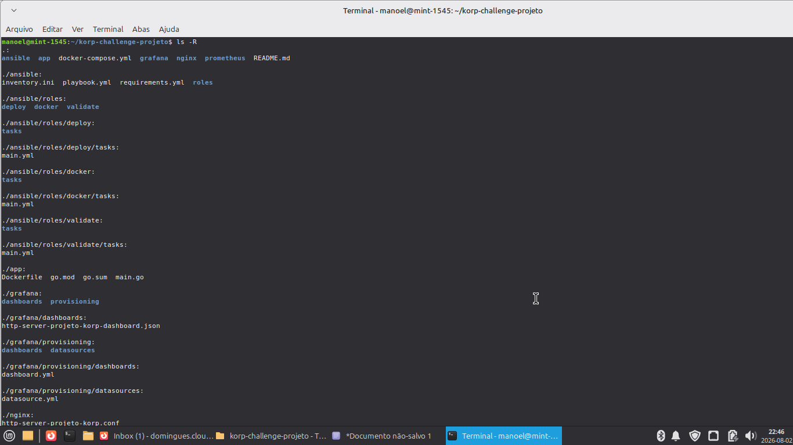

## Parte 2 — Serviço HTTP e Arquitetura
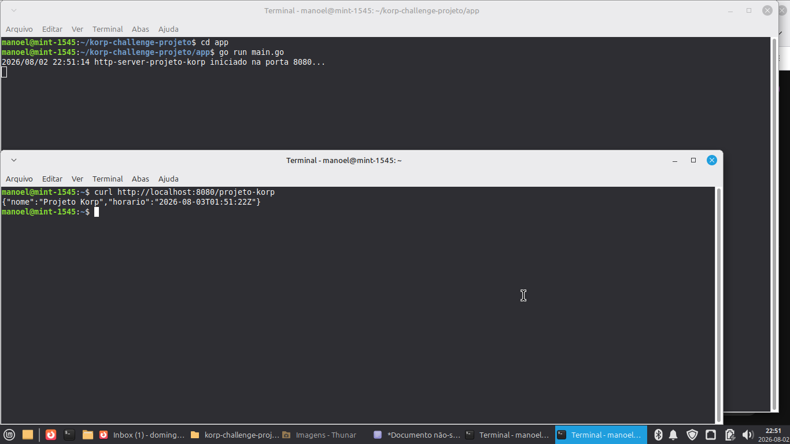 
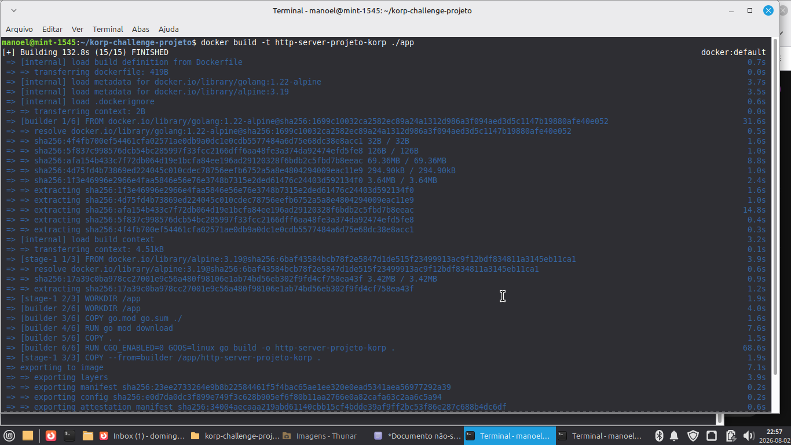
*Build da imagem Docker concluído com sucesso.*

## Parte 3 — Criação da Rede Docker em modo bridge
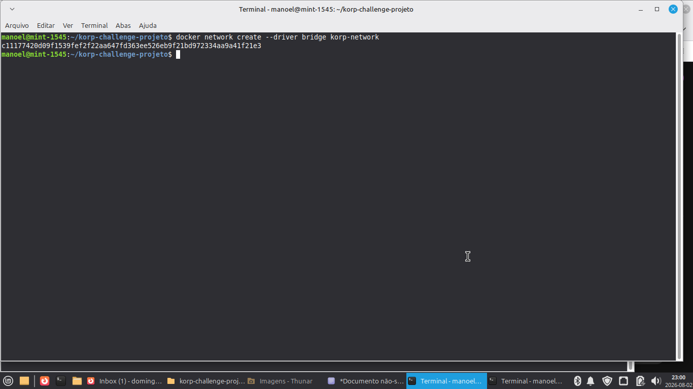 )
*Build da network concluído com sucesso.*

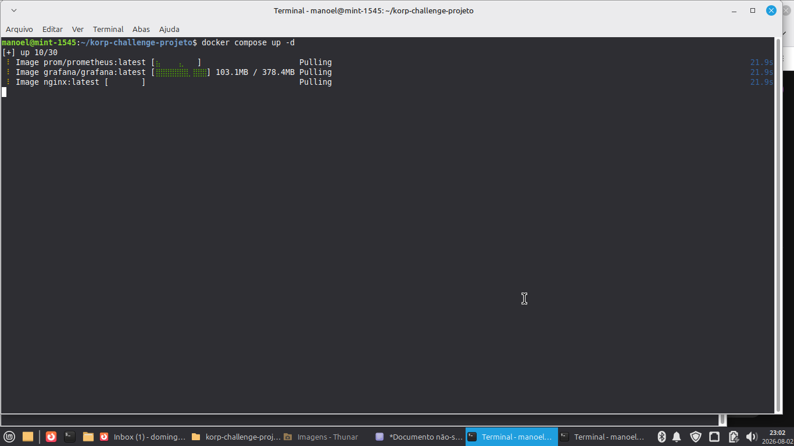
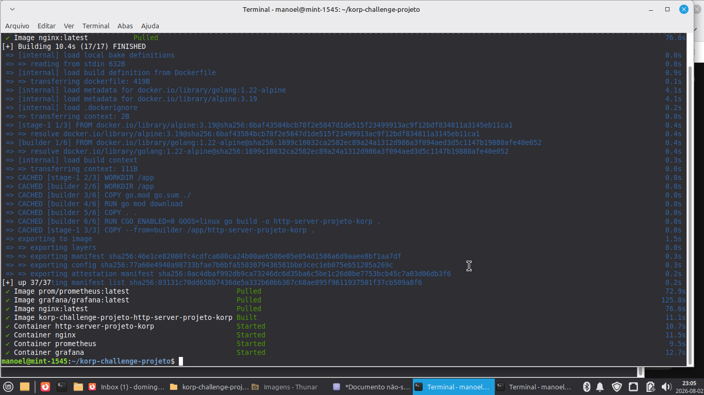
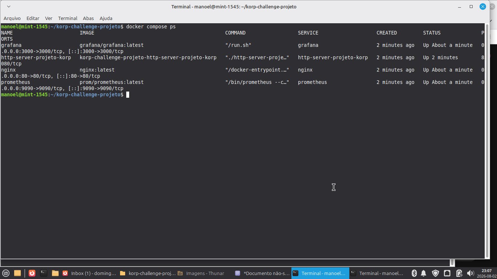
*Containers http-server-projeto-korp e nginx rodando via docker compose ps.*

## Parte 4 — NGINX
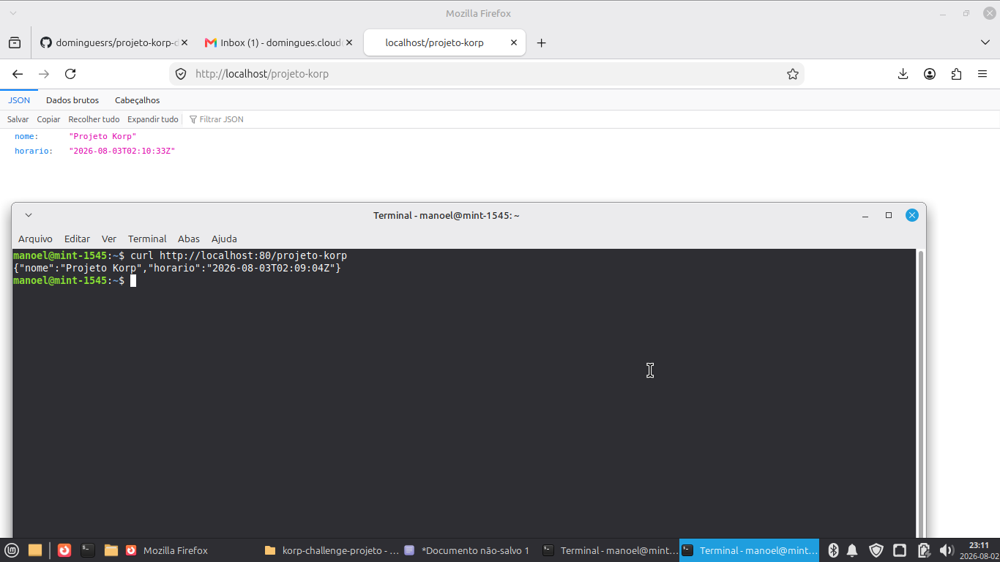
*Confirmação do proxy reverso funcional.*

## Parte 5 — Monitoramento
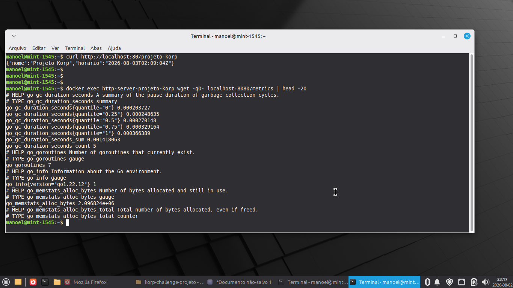
*Métricas de 'http_server_projeto_korp_requests_total' e 'http_server_projeto_korp_up'.*
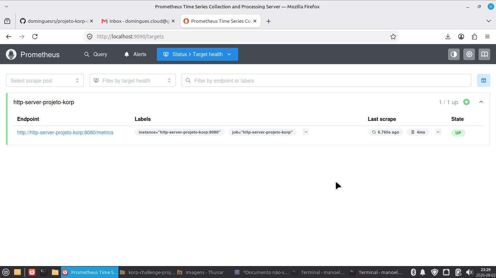
*Prometheus coletando métricas do serviço (status UP).*

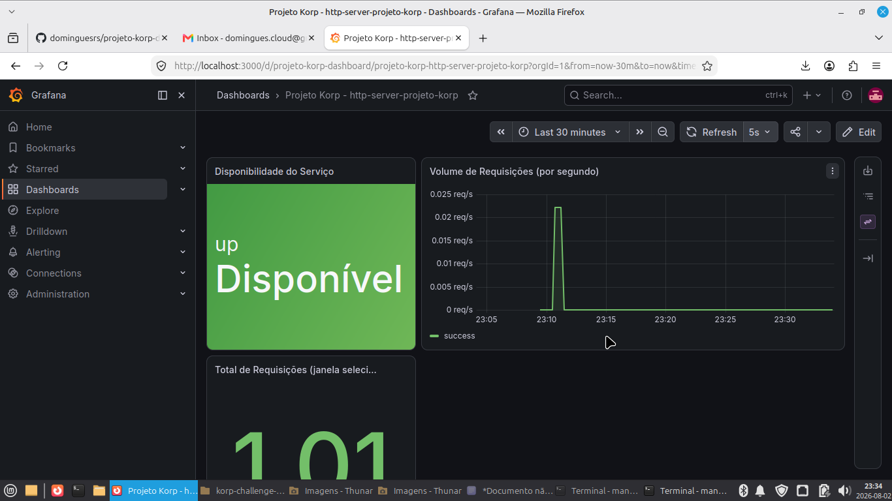
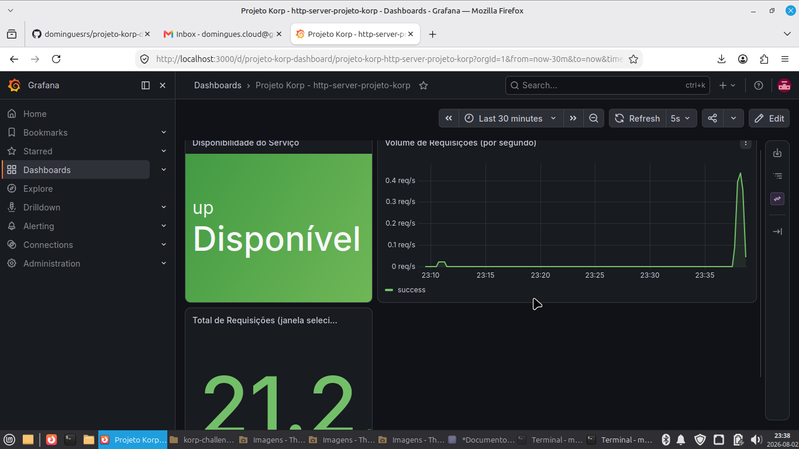
*Dashboard com painéis de disponibilidade e volume de requisições.*

## Parte 6 — Ansible
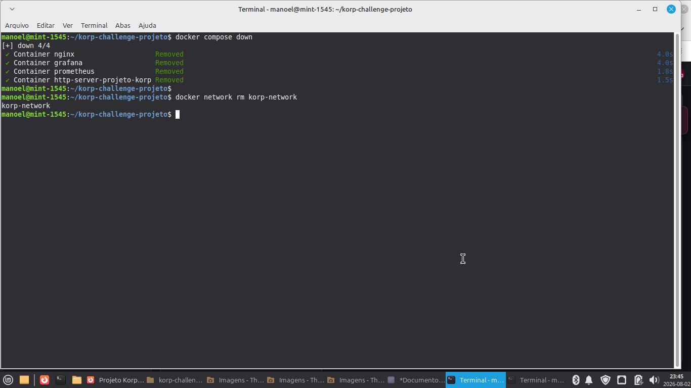
*Remoção dos containers e rede.*

# Parte 7 — Ansible
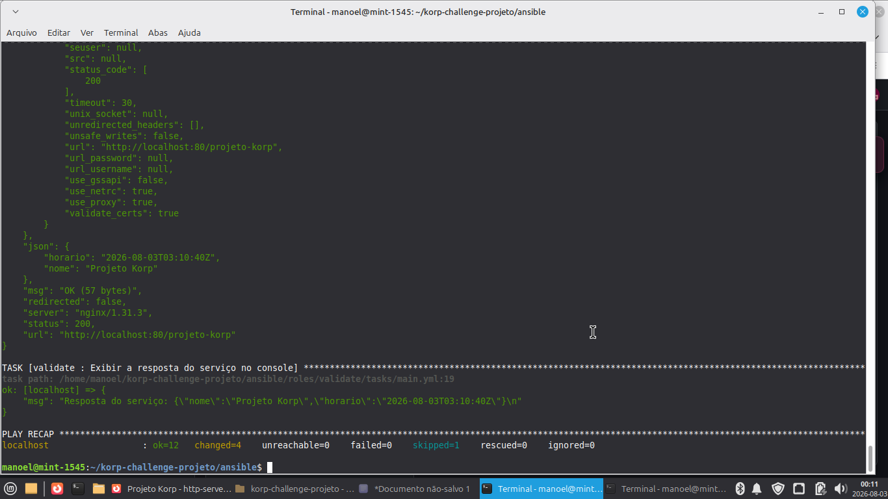
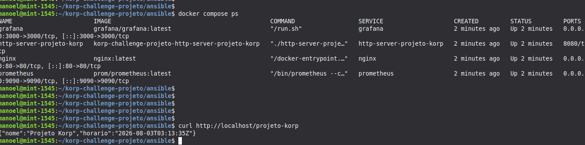
*Execução do playbook com um único comando, PLAY RECAP sem falhas.*

## Parte 8 — GitHub
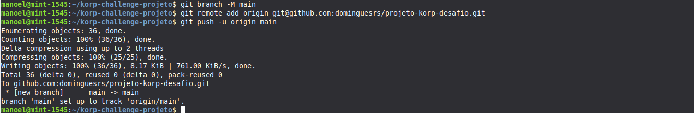
*Publicado o projeto no repositório.*

 
